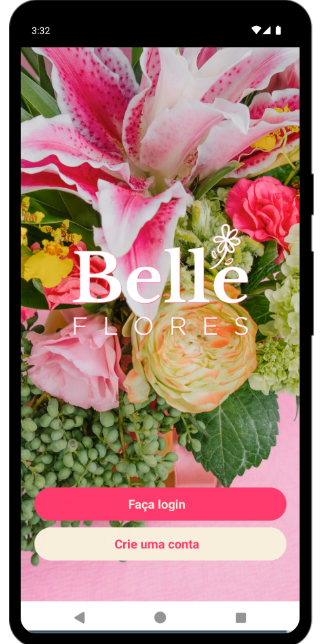
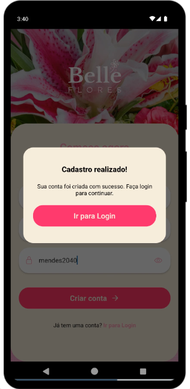
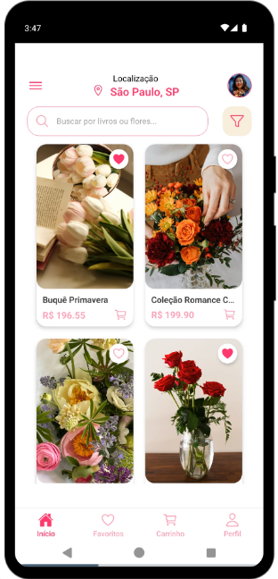
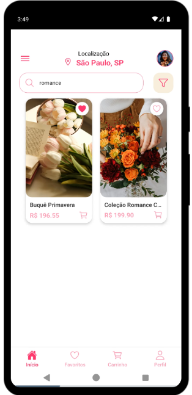
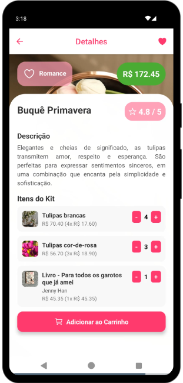
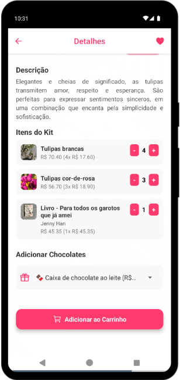
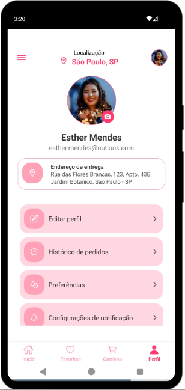
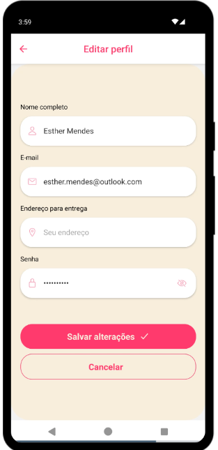
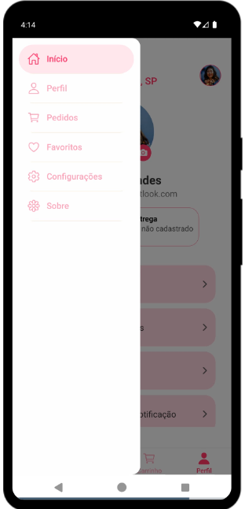

<div align="center">
    
</div>

**Belle Flores** é um aplicativo para floricultura, desenvolvido em **React Native + Expo**, que demonstra a integração de diferentes tipos de navegação (Stack, Drawer e Tab) e armazenamento de dados localmente através do **Async Storage**.
A aplicação foi desenvolvida para a disciplina de Programação para Dispositivos Móveis I em novembro de 2025.

<br />

## Screenshots

<div align="center">
    
    
    
    
    
    
    
    
    
    
    
    
    
    
    
</div>

<br />

## Passos para executar

Você pode baixar este projeto em arquivo .zip, clicando no botão <b>Code</b>, ou então seguir os passos abaixo para clonar o repositório em seu dispositivo:

```bash
# Clone o repositório
$ git clone https://github.com/Debora-Carvalho/react-native-belle-app.git

# Entre na pasta do projeto
$ cd react-native-belle-app

# Instale as dependências
$ npm install
```
Executando pelo **Expo Go (dispositivo móvel)** 

- Instale o aplicativo Expo Go no seu celular (disponível na Google Play Store ou App Store). 

- No terminal, inicie o servidor do Expo: 

```bash
npm start
```

- Um QR code será exibido no terminal ou no navegador. 

- Abra o Expo Go no celular e escaneie o QR code. O aplicativo será carregado automaticamente no seu dispositivo. 

Executando pelo **Android Studio (emulador)** 

- Abra o Android Studio e crie um emulador Android (AVD) com a versão desejada do Android. 

- No terminal do projeto, execute: 

```bash
npm run android
```
- O projeto será compilado e aberto no emulador.

## Tecnologias utilizadas


<br />

## Author

| [<br><sub>Débora Carvalho</sub>](https://github.com/Debora-Carvalho) |
| :---------------------------------------------------------------------------------------------------------------------------------------------------------------------------------------------: |
|                                                                [Linkedin](www.linkedin.com/in/debora-vieira-carvalho-45a478205)                                                                 |

<br />

Última atualização: nov.2025